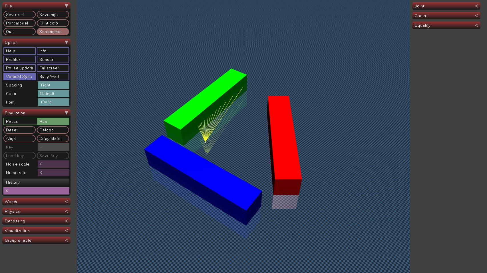
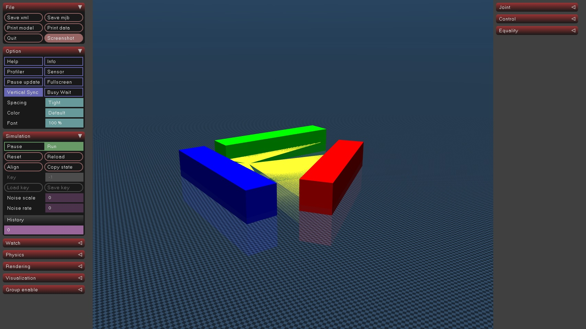
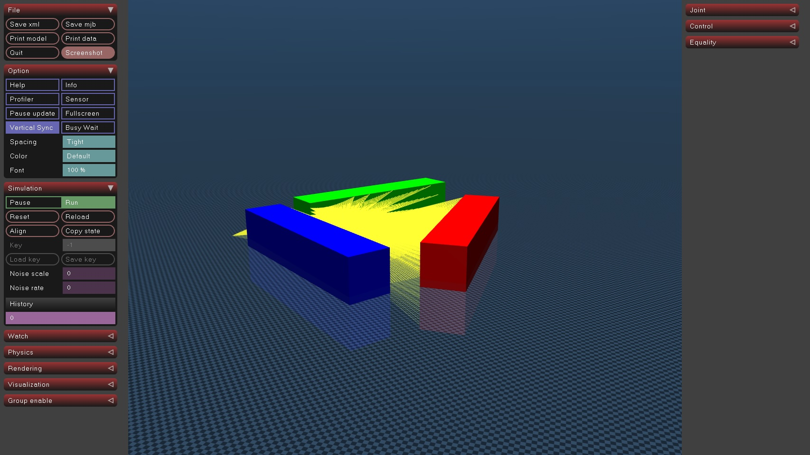

# 3-D Lidar Extension for Mujoco

## [Lidar](include/mujoco_3d_lidar/3dlidar.h)

This sensor uses ray casting to simulate lidar.

A `lidar` sensor is associated with a site and finds the nearest collision points from the site along a set of vectors.
The vectors are determined by the size and field of view parameters.

The sensor is parametrizable with the following:

1. Horizontal resolution (`size[0]`). _positive integer_
2. Vertical resolution (`size[1]`). _positive integer_
3. Horizontal field-of-view (`fov[0]`). _positive float in (0, 2 $\pi$.] radians_
4. Vertical field-of-view(`fov[1]`). _positive float in (0, $\pi$] radians_
5. Maximum Range. _positive float greater than 0.0 (m)_
6. Minimum Range. _positive float greater than 0.0 (m)_ (Optional, defaults to 0.0)
7. Update Rate. _positive float greater than 0.0 (Hz)_ (Optional, defaults to 0.0)
    * **Note**. This may be removed in future versions after the [interval attribute](https://mujoco.readthedocs.io/en/stable/modeling.html#sensors) is available for sensors.
8. Async. _boolean int (0 for false, non-zero for true)_ (Optional, defaults to 0)

Field of view should always be in radians regardless of the compiler options.

The horizontal fov is divided by the horizontal resolution to compute the number of azimuth angles.
The vertical fov is divided by the vertical resolution to compute the number of elevation angles.
Each azimuth/elevation pair defines a vector.
The distance result is the set of distances to collision from the site origin along that vector.

These parameters are passed as extension config attributes:

```xml
<mujoco>
  <extension>
    <plugin plugin="mujoco.sensor.lidar"/>
  </extension>
  ...
  <sensor>
    <plugin name="lidar" plugin="mujoco.plugin.lidar" objtype="site" objname="lidar_sensor">
      <config key="size" value="360 10"/>
      <config key="fov" value="6.2832 0.7854"/>
      <config key="max_range" value="13.0"/>
      <config key="min_range" value="1.0"/>
      <config key="update_rate" value="1.0"/>
      <config key="async" value="0"/>
    </plugin>
  </sensor>
</mujoco>
```

Note the following:

* The dimensionality of the sensor output is `size_x *size_y`.
* `objtype="site" objname="lidar"` specify that the sensor is associated with a
  site, and the name of the specific site.
* Field-of-view angles are always in radians.
* If async is specified, lidar computations are done in the background and data will be delayed.

### Example model


Lidar with:
 horizontal fov = 45 deg,
 vertical fov = 0,
 horizontal size = 15,
 vertical size = 1


Lidar with:
 horizontal fov = 360 deg,
 vertical fov = 0,
 horizontal size = 360,
 vertical size = 1


Lidar with:
 horizontal fov = 360 deg,
 vertical fov = 45,
 horizontal size = 360,
 vertical size = 4

See [lidar.xml](example/lidar.xml) to play with the model above.

## Standalone Build

This package is intended to be build alongside the `mujoco_ros2_control` packages.
However, we maintain a standalone build in the event that users want to pull this out and use it separately.
To compile, ensure `mujoco_vendor` is installed and available.

From this package's root:

```bash
mkdir build
cd build
cmake ..
make
```

This will create a mujoco_plugin directory alongside the mujoco binaries and install the lidar extension there.
It can now be found.

```bash
simulate example/lidar.xml
```
