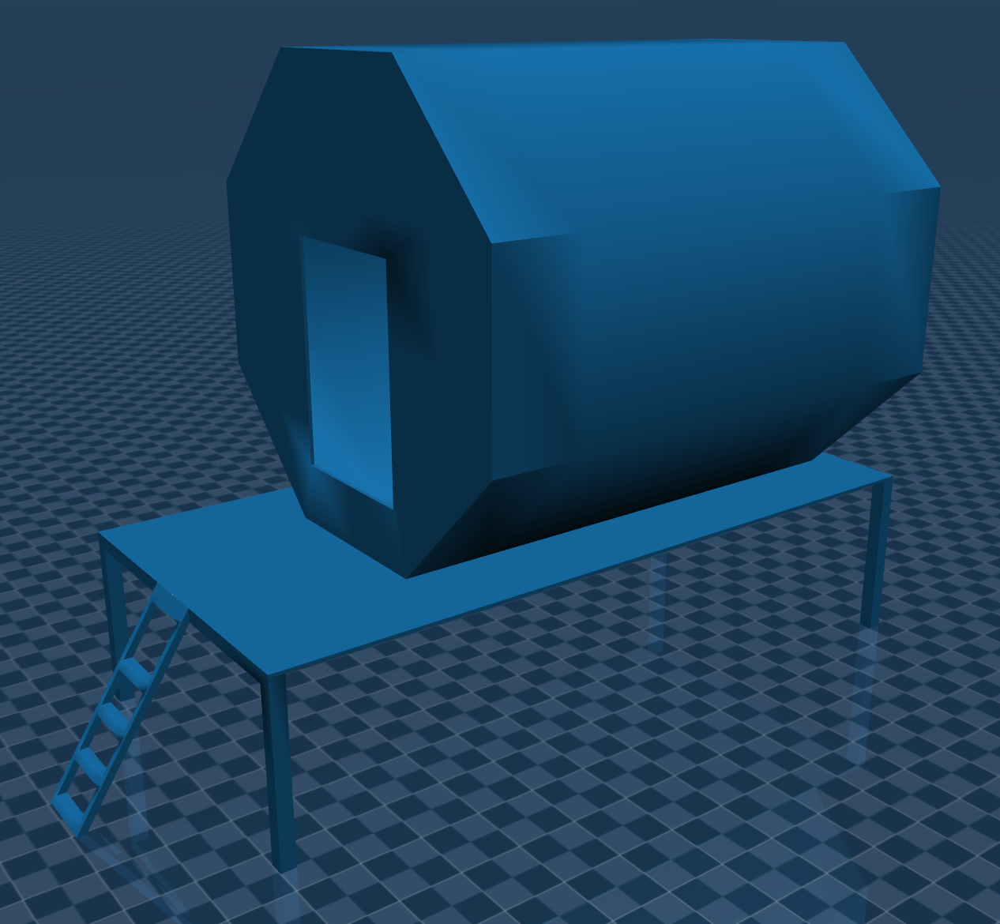
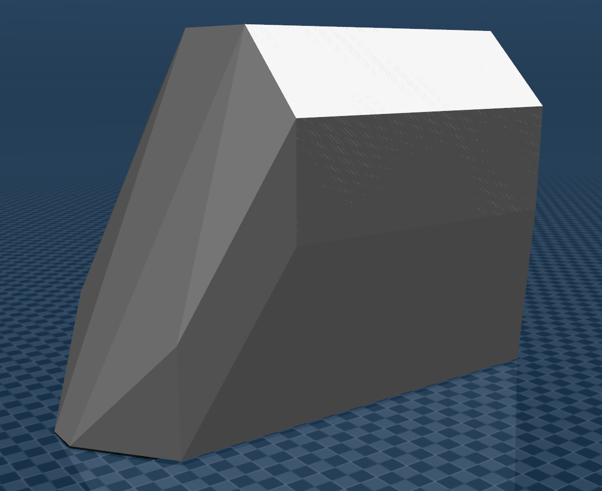
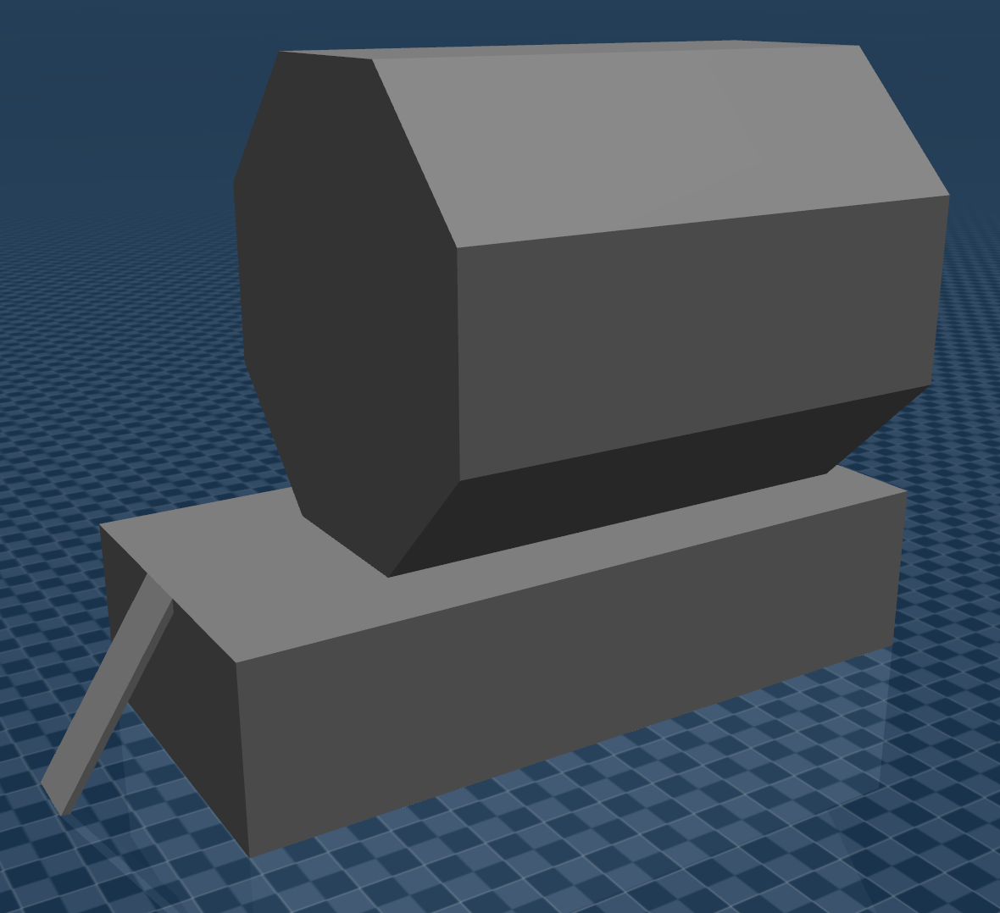

# Tips for Modeling Complex Geometries

General tips for modeling complex geometries in MuJoCo.
These lessons learned are largely based on use cases explored within the NASA Johnson Space Center [iMETRO facility](https://github.com/NASA-JSC-Robotics/iMETRO).

## Object URDFs

It is helpful to create a URDF to combine an object's sub-parts and keep these object URDFs in an environment/mockups package.

Having the object URDFs will make it easier to convert these objects to MJCFs later, as described in the [MJCF conversion documentation](./TOOLS.md).

## STL File Type

STLs come in two types: ASCII and binary.
CAD can export both types of STL, but RViz can only read binary STL files.
ASCII STL files can be converted to binary using the Python command line tool [`stlconverter`](https://pypi.org/project/stlconverter/).

## Interactions with Convex Hulls in MuJoCo

Determining how to model complex geometries depends on how the robot (or anything in the simulation) will interact with the objects.
When the STL files exported from CAD are run through the [conversion process](./TOOLS.md), MuJoCo draws convex hulls for collision checking around the model.
If an object is modeled as a singular asset, the convex hull will prevent the robot from interacting with any meaningful features of the object.
Instead, objects should be modeled as separate sub-parts that are brought together in the [object URDF](#object-urdfs).

We can see an example of how a low-fidelity lunar habitat concept is modeled in MuJoCo.

> [!WARNING]
> This depiction of a lunar habitat concept does not constitute an official design or official endorsement, either expressed or implied, by NASA.

The low-fidelity lunar habitat concept in MuJoCo:



> [!NOTE]
> To visualize convex hulls in the MuJoCo Simulate App, use the following keyboard shortcuts:
> - 2 (remove visual objects)
> - 3 (add collision objects)
> - H (show convex hulls)

An example of a convex hull around a low-fidelity lunar habitat concept modeled as a singular asset is depicted below; the robot is unable to reach onto the habitat porch because of how the convex hull is drawn around this asset.



Instead, models should be exported from CAD based on the meaningful sub-parts the robot will interact with.
The lunar habitat, for example, is exported as 3 sub-parts: the habitat module itself, the porch, and the stairs/ladder leading up to the porch.
The convex hull for the object with modeled sub-parts is depicted below.



Note that with this object breakdown, the robot *cannot* reach into the module itself, since the convex hull around the model closes any openings into the module.
Be aware that how objects are broken into sub-parts will depend on the application and any expected interactions with the object.

## Generate Object MJCFs

Objects that are not modeled within the standard URDF process (for example, moveable objects not modeled as part of the environment) need to be incorporated into the MuJoCo scene.
They can be integrated as:

- Separate MJCFs, if not using on-the-fly MJCF conversion;
or
- Included into a top-level URDF for on-the-fly MJCF conversion.

Regardless of the approach for integrating these objects, the process is ultimately very similar to that for [generating a robot MJCF](./TOOLS.md).

1.  If not already done in a description package:
    1.  Create STL models for the objects.
    2.  Create URDFs for the objects.
    Some objects may not require a special URDF using the [MuJoCo `ros2_control` hardware interface plugin](../README.md#plugin), since the robot is expected to interact with and move these objects.
    Instead, conversion can be performed directly on the environment/mockups URDFs or these URDFs can be xacro included into the top-level MuJoCo URDF.
2.  Create input(s) for the conversion process; each object can be converted separately or as part of a top-level MuJoCo inputs file.
Most important is decomposing any object sub-parts the robot will need to interact with.
This decomposition ensures the conves hulls for collision checking on these interactable sub-parts are accurate.
    1.  It can often be useful to see what level of precision has been used to decompose interactable sub-parts in past applications, specifically the [`threshold` attribute](./TOOLS.md#processed-inputs-attribute-reference).
1.  Run the conversion script.
2.  Test the conversion process has been completed properly:
    ```bash
    ros2 run mujoco_vendor simulate <Converted Description File>
    ```
